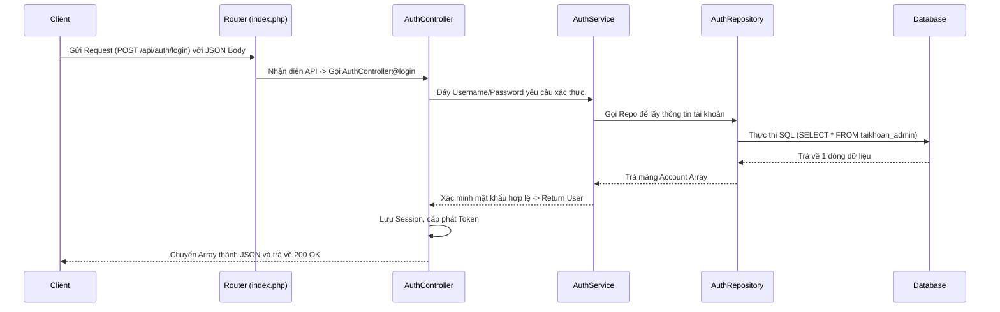

# Tài Liệu Bảo Vệ Đồ Án: Kiến Trúc MVC + Service (Hybrid API)

Khi giáo viên phản biện hỏi về kiến trúc mới của ứng dụng, bạn có thể tự tin trình bày theo các điểm cốt lõi dưới đây. Kiến trúc này không chỉ đáp ứng yêu cầu môn học mà còn đạt chuẩn của một ứng dụng Web hiện đại cấp Doanh nghiệp (Enterprise).

## 1. Mô hình tổng quan: "Hybrid API" (Lai giữa SSR và API)

Hệ thống của chúng ta hiện tại đang sử dụng mô hình **MVC kết hợp Service Pattern**, và đặc biệt là cơ chế **Hybrid (Lai)**:

- **Đa nhiệm:** Hệ thống vừa có thể đóng vai trò là một trang Web truyền thống (trả về giao diện HTML Server-Side Rendering), vừa có thể đóng vai trò là một RESTful API Server (trả về dữ liệu JSON cho Mobile App hoặc React/Vue) sử dụng chung **100% logic nghiệp vụ**.
- **Điểm chạm duy nhất (Single Entry Point):** Mọi request dù là xin giao diện hay xin dữ liệu đều đi qua "kẻ gác cổng" `Public/index.php`. Tại đây, router sẽ phân luồng:
  - Nếu URL có tiền tố `api/`, nó ép hệ thống trả về JSON và tự động map HTTP Methods (GET, POST, PUT, DELETE).
  - Nếu không, nó trả về giao diện HTML thông thường.

## 2. Luồng đi của Dữ liệu (Data Flow)

Để dễ hiểu, hãy lấy ví dụ khi người dùng gửi yêu cầu: `POST /api/auth/login` (Gửi API Đăng nhập)

## 3. Cơ chế Bảo mật và Phân quyền (Authentication Flow)

Hệ thống cung cấp một bức tường lửa tại `Core\Controller` có tên là hàm `requireAuth()`.
Toàn bộ các Controller nhạy cảm (Quản lý Phòng, Sinh Viên, Hợp Đồng...) đều gọi hàm này ngay ở hàm khởi tạo (`__construct`).

**Quy trình hoạt động:**

1. Khi người dùng chưa đăng nhập cố tình truy cập `/room`.
2. `RoomController` được khởi tạo, nó gọi `$this->requireAuth()`.
3. Hàm này phát hiện `$_SESSION['username']` đang trống.
4. Nó kiểm tra:
   - Nếu là yêu cầu API: Trả về **HTTP 401 Unauthorized** kèm cục JSON báo lỗi.
   - Nếu là yêu cầu Trình duyệt: Lập tức đá người dùng (Redirect) về trang `/auth/login`.

> [!TIP]
> Việc nhét hàm `requireAuth()` vào hàm khởi tạo của Controller giúp bạn không bao giờ bị quên bảo mật bất kỳ action (hàm) nào bên trong class đó. Chỉ viết 1 lần nhưng bảo vệ được cả class!

## 4. Tách biệt Trách nhiệm (Separation of Concerns)

Khác với mô hình MVC sinh viên bình thường (viết mọi thứ từ check điều kiện đến gõ câu SQL vào Controller), chúng ta chia hệ thống thành 4 tầng rạch ròi:

> [!IMPORTANT]  
> Đây là điểm "ăn tiền" nhất khi bảo vệ đồ án. Hãy nhấn mạnh vào sự tách biệt này!

1.  **Tầng Controller (Người điều phối - Dispatcher):**
    - Chỉ làm 2 việc: Nhận Request từ người dùng (POST, GET, Raw JSON) và Trả về Response (HTML View hoặc API JSON).
    - Tuyệt đối **KHÔNG** chứa các vòng lặp nghiệp vụ hay câu lệnh SQL nào ở đây.

2.  **Tầng Service (Bộ não nghiệp vụ - Business Logic):**
    - Nơi chứa chất xám của ứng dụng (Ví dụ: Kiểm tra xem tài khoản có bị khóa không, kiểm tra mật khẩu có khớp không, kiểm tra mã phòng có hợp lệ với mã tòa không).
    - Nếu quy tắc kinh doanh thay đổi, ta chỉ sửa ở đây. Controller không cần biết.

3.  **Tầng Repository (Người giao tiếp Database - Data Access Layer):**
    - Tầng duy nhất được phép chứa các câu lệnh SQL thô (`SELECT`, `INSERT`, `UPDATE`).
    - Nếu sau này công ty yêu cầu đổi từ MySQL sang SQL Server hay MongoDB, ta chỉ cần thay các file Repository. 3 tầng trên vẫn hoạt động hoàn hảo.

4.  **Tầng Core/Router:**
    - `Core\Controller`: Cung cấp các hàm công cụ chung (`view()`, `jsonResponse()`, `getInput()`). Đặc biệt, `getInput()` được lập trình thông minh để tự động bắt cả dữ liệu Form (`$_POST`) lẫn dữ liệu JSON phi tuyến (`php://input`).

## 5. Tại sao lại chọn kiến trúc này? (Ưu điểm)

- **Tái sử dụng Code (DRY):** Một logic xử lý như Đăng nhập được viết trong Service, sau đó được dùng chung cho cả Web View lẫn Mobile App API.

- **Bảo mật & Tránh SQL Injection:** Sử dụng `bind_param` của PDO/MySQLi trong Repository, không cộng chuỗi SQL trực tiếp.

- **Dễ bảo trì & Mở rộng:** Lỗi sai cấu trúc DB -> Tìm đến Repository. Lỗi sai quy trình -> Tìm đến Service. Lỗi lệch giao diện -> Tìm đến View. Cực kỳ dễ gỡ rối!
