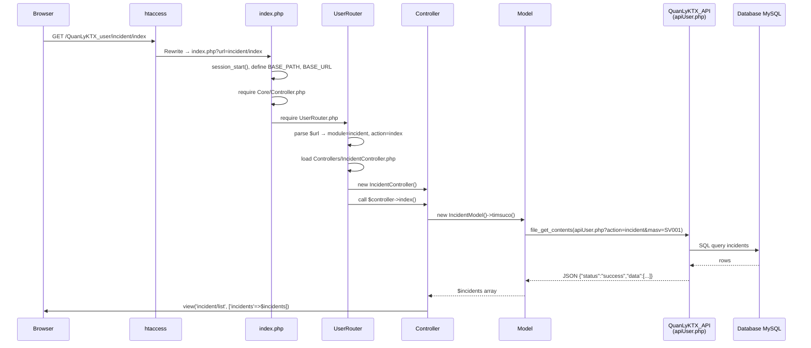

# Kiến trúc & Luồng hoạt động — QuanLyKTX_user

## 1. Cấu trúc thư mục

```
QuanLyKTX_user/
│
├── index.php            ← Entry Point duy nhất (khởi động session, define constant, load router)
├── UserRouter.php       ← Router: phân tích URL → gọi Controller đúng
├── .htaccess            ← Rewrite tất cả request về index.php?url=...
│
├── Core/
│   └── Controller.php   ← Base class abstract (view, redirect, json, session helpers...)
│
├── Controllers/         ← Xử lý logic từng tính năng
│   ├── AuthController.php
│   ├── RoomController.php
│   ├── ContractController.php
│   ├── IncidentController.php
│   └── StudentController.php
│
├── Models/              ← Giao tiếp với API (KHÔNG dùng DB trực tiếp)
│   ├── Auth.php         → gọi API: login, student, change_password
│   ├── Room.php         → gọi API: room
│   ├── Contract.php     → gọi API: contract
│   ├── Incident.php     → gọi API: incident, reportIncident
│   └── Student.php      → gọi API: student, student_update
│
└── Views/               ← Giao diện HTML (mỗi module một thư mục)
    ├── Auth/
    ├── Room/
    ├── Contract/
    ├── Incident/
    └── Student/
```

---

## 2. Luồng hoạt động (Request Flow)



---

## 3. Chi tiết từng tầng

### 3.1 Entry Point — `index.php`

| Việc làm         | Chi tiết                                                               |
| ---------------- | ---------------------------------------------------------------------- |
| Đặt tên session  | `session_name('USER_KTX_STUDENT')` để tránh xung đột với session admin |
| Define constant  | `BASE_PATH`, `BASE_URL`                                                |
| Load base class  | `Core/Controller.php`                                                  |
| Khởi động router | `UserRouter.php`                                                       |

> [!NOTE]
> **Không có** `require Database.php` vì toàn bộ data đến từ API — không kết nối DB trực tiếp.

---

### 3.2 Router — `UserRouter.php`

Phân tích URL theo pattern: `/{module}/{action}/{params...}`

| URL ví dụ          | module              | action    | params |
| ------------------ | ------------------- | --------- | ------ |
| `/auth`            | auth                | index     | []     |
| `/auth/login`      | auth                | login     | []     |
| `/auth/dashboard`  | auth                | dashboard | []     |
| `/incident/index`  | incident            | index     | []     |
| `/incident/baocao` | incident            | baocao    | []     |
| `/dashboard`       | _(shortcut)_ → auth | dashboard | []     |

**Quy tắc resolve Controller:**

```
module = "incident"  →  IncidentController  →  Controllers/IncidentController.php
module = "auth"      →  AuthController      →  Controllers/AuthController.php
```

**Fallback:** nếu Controller không tồn tại → redirect về login hoặc dashboard tuỳ session.

---

### 3.3 Models — Cách gọi API từ `apiUser.php`

Đây là trái tim của kiến trúc. **Mỗi Model đều có:**

```php
private $apiUrl = 'http://localhost/HellomynameisPencilan/QuanLyKTX_API/Routes/apiUser.php';
```

#### Cách gọi GET (đọc dữ liệu):

```php
// Ví dụ Room.php — lấy phòng theo masv
$url = $this->apiUrl . '?action=room&masv=' . urlencode($masv);
$result = @file_get_contents($url);          // PHP gửi HTTP GET
$response = json_decode($result, true);      // parse JSON về mảng
return $response['data'];                    // trả về data cho Controller
```

#### Cách gọi POST (gửi dữ liệu):

```php
// Ví dụ Incident.php — báo cáo sự cố
$url = $this->apiUrl . '?action=reportIncident';
$data = http_build_query(['masv'=>$masv, 'maphong'=>$maphong, 'mota'=>$mota, 'ngaybao'=>$ngaybao]);

$options = [
    'http' => [
        'header'  => "Content-type: application/x-www-form-urlencoded\r\n",
        'method'  => 'POST',
        'content' => $data,
        'timeout' => 5
    ]
];
$context = stream_context_create($options);
$result  = @file_get_contents($url, false, $context);   // PHP gửi HTTP POST
```

---

### 3.4 Map đầy đủ: Model → API action

| Model class     | Method                  | action gọi API    | HTTP |
| --------------- | ----------------------- | ----------------- | ---- |
| `AuthModel`     | `authenticate()`        | `login`           | POST |
| `AuthModel`     | `getNameByMaSV()`       | `student`         | GET  |
| `AuthModel`     | `changePassword()`      | `change_password` | POST |
| `RoomModel`     | `findByMasv()`          | `room`            | GET  |
| `ContractModel` | `findByMaSV()`          | `contract`        | GET  |
| `IncidentModel` | `findByMasv()`          | `incident`        | GET  |
| `IncidentModel` | `sendIncidentRequest()` | `reportIncident`  | POST |
| `StudentModel`  | _(student_update)_      | `student_update`  | POST |

---

## 4. Bên phía API — `QuanLyKTX_API/Routes/apiUser.php`

File này là **gateway duy nhất** nhận request từ `QuanLyKTX_user`:

```
QuanLyKTX_API/
├── Routes/
│   └── apiUser.php          ← switch($action) → gọi UserController
├── Controllers/
│   └── UserController.php   ← xử lý từng action
└── Models/
    └── UserRepository.php   ← truy vấn MySQL
```

`apiUser.php` dispatch theo `?action=...`:

```php
$controller = new UserController();
$action = $_GET['action'] ?? $_POST['action'] ?? '';

switch ($action) {
    case 'login':          $controller->login();          break;
    case 'student':        $controller->student();        break;
    case 'student_update': $controller->student_update(); break;
    case 'change_password':$controller->change_password();break;
    case 'room':           $controller->room();           break;
    case 'contract':       $controller->contract();       break;
    case 'incident':       $controller->incident();       break;
    case 'reportIncident': $controller->reportIncident(); break;
}
```

Luôn trả về JSON dạng:

```json
{ "status": "success", "data": { ... } }
{ "status": "error",   "message": "..." }
```

---

## 5. Sơ đồ kiến trúc tổng quan

```
┌─────────────────────────────────────────────────────┐
│                  BROWSER (sinh viên)                │
└────────────────────────┬────────────────────────────┘
                         │ HTTP Request
                         ▼
┌─────────────────────────────────────────────────────┐
│              QuanLyKTX_USER (MVC Frontend)          │
│                                                     │
│  .htaccess  →  index.php  →  UserRouter.php         │
│                                  │                  │
│                        ┌─────────▼──────────┐       │
│                        │    Controllers/    │       │
│                        │  AuthController    │       │
│                        │  IncidentController│       │
│                        │  RoomController    │       │
│                        └─────────┬──────────┘       │
│                                  │                  │
│                        ┌─────────▼──────────┐       │
│                        │      Models/        │       │
│                        │  Auth.php           │       │
│                        │  Incident.php  ─────┼──────┐│
│                        │  Room.php           │      ││
│                        └─────────────────────┘      ││
└─────────────────────────────────────────────────────┘│
                              file_get_contents()      │
                              (PHP internal HTTP call) │
                                                       │
┌─────────────────────────────────────────────────────▼┐
│              QuanLyKTX_API (Backend API)             │
│                                                      │
│  Routes/apiUser.php  →  UserController.php           │
│                              │                       │
│                    UserRepository.php                │
│                              │                       │
│                         MySQL DB                     │
└──────────────────────────────────────────────────────┘
```

---

## 6. Session & Bảo mật

| Key session | Giá trị              | Dùng ở đâu               |
| ----------- | -------------------- | ------------------------ |
| `user_id`   | `masv` của sinh viên | Kiểm tra đã login chưa   |
| `masv`      | Mã số sinh viên      | Truyền vào API khi query |
| `hoten`     | Họ tên sinh viên     | Hiển thị trên giao diện  |

- Session name riêng: `USER_KTX_STUDENT` (tránh xung đột với session admin)
- Mọi Controller đều gọi `ensureLoggedIn()` hoặc check `getSession('user_id')` trước khi cho truy cập

> [!WARNING]
> Hiện tại `masv` lấy thẳng từ `$_SESSION['masv']` khi gọi API — cần đảm bảo session không bị giả mạo ở phía server.
